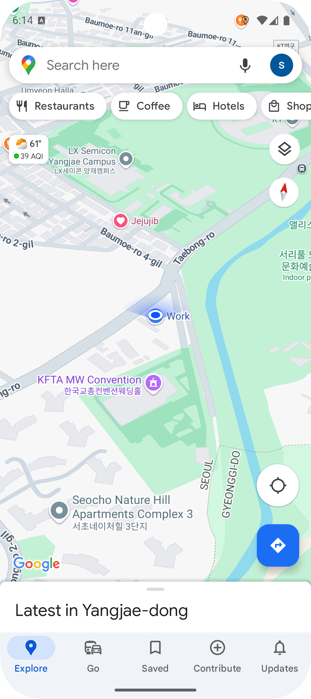
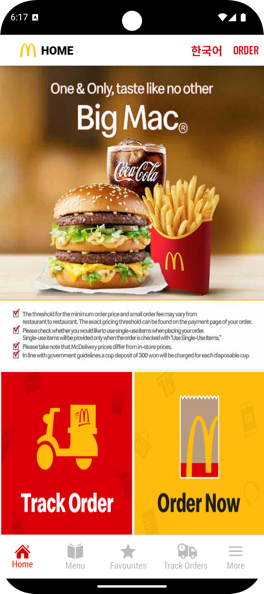

# 📱 Vision‑Language Mobile Agent

This repo shows an end‑to‑end pipeline that

1. **grabs a screenshot** from an Android emulator running on your laptop,  
2. **sends** it (along with a natural‑language task) to a remote **FastAPI server** that hosts a Vision‑Language Model (VLM),  
3. gets back a proposed UI **action** (tap, swipe, type, …),  
4. and **executes** that action on the emulator via `adb`.

The two main entry‑point files are:

| file | role |
|------|------|
| `<<model>>_server.py` | FastAPI server that loads **Qwen‑2.5-VL** (or any other VLM) and returns an action JSON |
| `client.py` | Laptop‑side script: captures screenshots, calls the server, and translates the JSON into `adb` commands |

---

## 0. Prerequisites

| Machine | Requirements |
|---------|--------------|
| **Server** | • Linux with CUDA‑capable GPU (24 GB VRAM recommended)<br>• Python ≥ 3.10<br>• `torch` + `transformers`<br>• **Hugging Face Access Token** (because `Qwen2.5‑VL` is gated) |
| **Laptop / Local PC** | • Android Studio with a running **AVD**<br>• `adb` available in `$PATH`<br>• Python ≥ 3.10 |

---

## 1. Server setup  (`qwen_server.py`,`uitars_server.py`,`pav_server.py`(not yet))

```bash
# 1‑A. Create & activate venv / conda env
conda create -n agent python=3.10 -y
conda activate agent

# 1‑B. Install deps
pip install torch==2.6.0 torchvision==0.21.0 torchaudio==2.6.0 --index-url https://download.pytorch.org/whl/cu118
pip install -r qwen_requirements.txt

# 1‑C. (one‑time) login to Hugging Face – needed for Qwen‑VL
huggingface-cli login
# paste your HF access‑token (READ scope)

# 1‑D. Launch the server
uvicorn qwen_server:app --host 0.0.0.0 --port 8000
```

If everything loads correctly you should see:
```bash
INFO:     Uvicorn running on http://0.0.0.0:8000
Model loaded successfully.
```

## 2. Local Client setup (`client.py`)
```bash
# 2‑A. Create venv
conda create -n agent_cli python=3.10 -y
conda activate agent_cli

# 2‑B. Install deps
pip install requests pillow

# 2‑C. Make sure `adb` is in PATH

adb devices   # should list your AVD, e.g. emulator‑5554

# ADB path set
export ANDROID_HOME=$HOME/Library/Android/sdk
export PATH=$PATH:$ANDROID_HOME/platform-tools
source ~/.zshrc # or source ~/.bashrc
```


## 3. Usage
### 3-A. Start Android emulator
- Turn on your Android studio and activate an emulator (e.g., Pixel9 API36)
- Set location to the designated place (Seoul Ai Hub)
- Login Google Account
- For Google Maps task, set the starting point should be below image
  - 
- For McDelivery task, set the starting point should be below image
  - 
  
**You can set the starting point easily with Snapshot in Android Studio!!**

### 3-B. Run the client script
- **Don't forget that the server (`uvicorn qwen_server:app --host 0.0.0.0 --port 8000`) is already on run**
```bash
python client.py \
  --server http://<SERVER_IP>:8000/predict \
  --device_id emulator-5554 \
  --task "Please display the route to Gwanghwamun Square." \
  --image_path "qwen_7b_baseline_google_screenshots" \
  --max_steps 10
```
